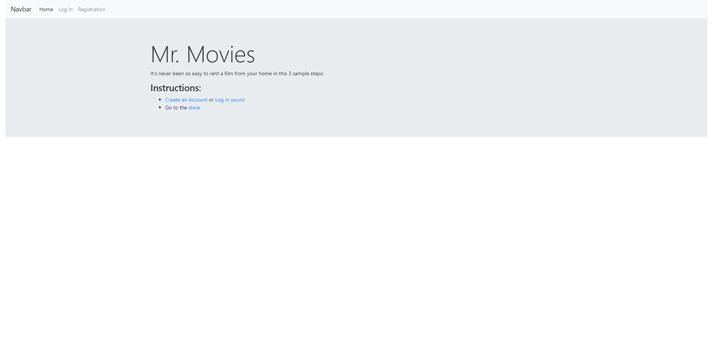
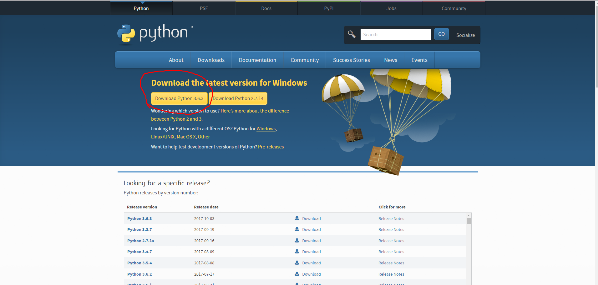
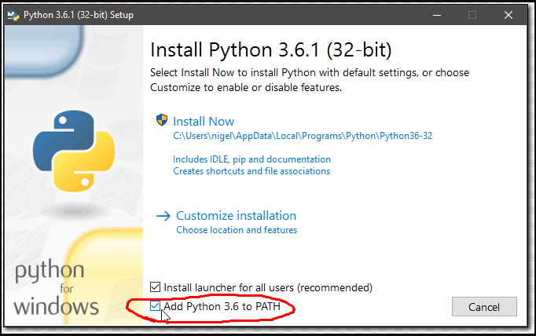

# rentalapp

This is a Movie Rental Aplication based on Angular JS and Django/Python. This application let you manage your movie rentales with one click and the Django Admin to manage your movie.

The REST is include.

You need to have Python installed on Machine. (Preferebly, 3.6 and above)
_if you need install python, at the final i wrote an optional step_



#### Install the enviroment

Skip this step if you don't care about virtualenv
```
For Windows: pip install virtualenvwrapper-win
For Unix: pip install virtualenvwrapper
```

#### Install the project
```
$ git clone https://github.com/manuhazen/rentalapp.git
$ cd rentalapp
$ mkvirtualenv examplename (skip this one if you skipped the virtualenv installation)
$ pip install -r requirements.txt
$ python manage.py makemigrations
$ python manage.py migrate
Note: in this step i recommend load the dummydata in the site, is in the next step-section
$ python manage.py createsuperuser
$ python manage.py runserver
```

#### Dummy Data 

The project has some dummy data, if you want to use it run this step
```
$ python manage.py loaddata db.json
```

##### Optional: How to install Python

For Windows:

Enter at the Official Page Python and click the red circled Button:


Don't forget add Python to the PATH by this button


And you're good to go.

For Unix: 
```
$ sudo apt-get update
$ sudo apt-get install python3.6
```

And you're good to go.

The application will be running in http://127.0.0.1:8000/